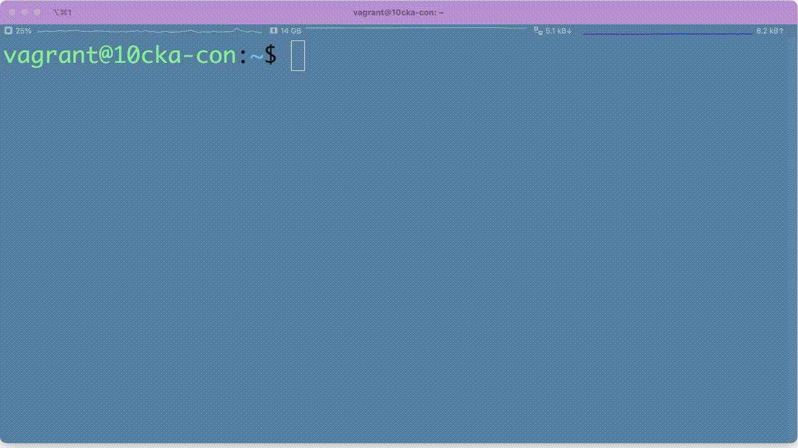
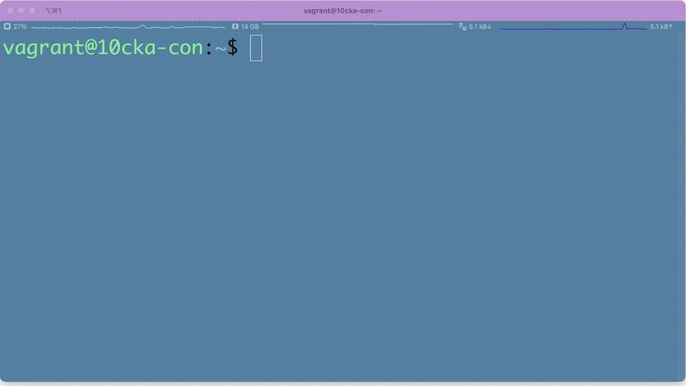

# `kubectxon`: Show on active-context

[](https://semver.org)

[](https://opensource.org/licenses/Apache-2.0)

**`kubectxon`** helps to avoid your mistake as show up active-context on the prompt:


**`kubectxon`** supports color variation on the prompt:


# kubectxon

kubectxon is a utility to show up the active-context.

```
USAGE:
  kubectx                   : list the contexts
  kubectx <NAME>            : switch to context <NAME>
  kubectx -                 : switch to the previous context
  kubectx -c, --current     : show the current context name
  kubectx <NEW_NAME>=<NAME> : rename context <NAME> to <NEW_NAME>
  kubectx <NEW_NAME>=.      : rename current-context to <NEW_NAME>
  kubectx -d <NAME>         : delete context <NAME> ('.' for current-context)
                              (this command won't delete the user/cluster entry
                              that is used by the context)
  kubectx -u, --unset       : unset the current context
```

### Usage

```bash
$ kubectl config get-contexts 
CURRENT   NAME     CLUSTER        AUTHINFO     NAMESPACE
*         beer     cluster-wk8s   wk8s-admin   
          bread    cluster-bk8s   bk8s-admin   
          coffee   cluster-hk8s   hk8s-admin 

$ kubectxon
Current state is "on"
$ (beer)

$ (beer) kubectxon
Current state is "off"
$ 
```

-----

## Installation
⚠️ **Caution**: It support only 'BASH' Shell above 5.0.  
- As a `krew` which kubernetes plugins 
- Manual installation

#### krew (under construction)
You can install and use [Krew](https://github.com/kubernetes-sigs/krew/) kubectl
plugin manager to get `kubectxon` 
```bash
$ kubectl krew install ctxon 
```

After installing, the tool will be available as `kubectl ctxon`.

### krew-2 (custom-index)
You can install and use [Krew](https://github.com/kubernetes-sigs/krew/) kubectl
plugin manager to get `kubectxon` 
```bash
$ kubectl krew index add cix https://github.com/sysnet4admin/custom-index.git
$ kubectl krew install cix/ctxon
```

After installing, the tool will be available as `kubectl ctxon`.
I recommend to alias `kubectxon` like below: 

```bash
$ echo "alias kubectxon='kubectl ctxon'" >> ~/.bashrc
$ source ~/.bashrc
```


### Manual

Since `kubectxon` is written in Bash, you should be able to install
them to any POSIX environment that has Bash installed.

- Download the `kubectxon` scripts.
- Either:
  - save them all to somewhere in your `PATH`,
  - or save them to a directory, then create symlinks to `kubectx`/`kubens` from
    somewhere in your `PATH`, like `/usr/local/bin`
- Make `kubectxon` executable (`chmod +x ...`)
```bash
$ git clone https://github.com/sysnet4admin/kubectxon.git
$ cd kubectxon
$ ./kubectxon
```

**OR**

```bash
$ curl -O https://raw.githubusercontent.com/sysnet4admin/kubectxon/main/kubectxon
$ chmod +x kubectxon
$ ./kubectxon
```

-----

### Uninstall kubectxon 
**`kubectxon`** supports `uninstall` option for your convenience :) 


